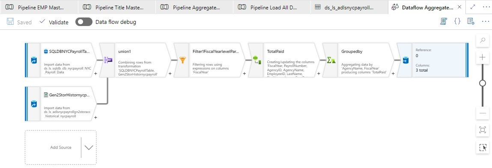

# 2023-AzureFactory-AutomatedPipe
<h1 align="center">
   
  
   
  Development Technologies 
   
</h1>

  
  
  
  
  

 
  

  <a href="#Purpose">Purpose</a> •
  <a href="#how-to-use">How It Work</a> •
  <a href="#CodeFlow">Code Flow</a> •
  <a href="#Credit">Credit</a> •
  <a href="#Screen">Screen</a> •

## Purpose
The goal of this project is to develop a Delta Lake solution using Azure Databricks.
Bussiness Requirements :
* Time-sensitive reports for trips
* Time-sensitive reports for payments
* Analytics per individuals and age groups
* Analytics per individual trips and payments 

> **Note**
> Resources related to each step are divided into their respective folders.

## CodeFlow

Step 0: Load CSV Archive File to Azure Databricks HBFS
In this step, the initial data is loaded into Azure Databricks, which is a cloud-based big data processing platform. Specifically, the CSV archive file is loaded into the Hadoop File System (HBFS), which is a distributed file system designed to store large data sets across multiple nodes. This step is necessary to provide a centralized location for the data to be stored and accessed by subsequent processing steps.

Step 1: Bronze Step - Load CSV Files into HBFS and Save as Delta Files
The next step is to load the raw CSV files into HBFS and save them as Delta files. Delta is a file format that supports ACID transactions and allows for efficient processing of large data sets. By saving the raw data as Delta files, we create a "Bronze" layer that serves as a raw data store that can be accessed by subsequent processing steps. This step also involves cleaning and transforming the data as necessary to prepare it for further processing.

Step 2: Silver Step - Clean, Manipulate, and Deduplicate Data
The Silver step involves processing the data in the Bronze layer and transforming it into a format that is more suitable for analysis. This may involve tasks such as cleaning the data, manipulating it to derive new fields, and dropping duplicate records. The resulting data is then saved as Delta files in a "Silver" layer, which serves as an intermediate data store that can be accessed by subsequent processing steps.

Step 3: Gold Step - Design and Load Star Schema
The final step is to design and load a Star schema based on the business requirements and optimization for operation. The Star schema is a relational schema that organizes data into fact and dimension tables for efficient querying and analysis. In this step, we will use the data in the Silver layer to design the Star schema and then load the resulting data into a "Gold" layer that serves as the final data store for analysis. This step also involves optimizing the schema for query performance and indexing the data as necessary.

Overall, this process involves progressively refining and transforming the data as it moves from the raw data store to the final data store, resulting in a well-organized and optimized data set that can be efficiently analyzed and queried.

## How It Work

* To install and set up the project, please follow these steps:

1-Clone the repository from GitHub. 
2-Set up an Azure account and create an Azure Data Factory instance. 
3-Create a Delta Lake table in Azure Databricks. 
4-Load the CSV archive file to the HBFS in Azure Databricks. 
5-Use Delta Lake to convert the CSV files in the HBFS to Delta files. 
6-Clean and manipulate the Delta files in Azure Databricks and save them to Silver tables. 
7-Design a star schema based on business requirements and optimization for operation. 
8-Use SQL scripts to transform the Silver tables into the final star schema designed in Step 7 and save them in Gold tables. 

The key features and functionality of this project include:

* Ingesting data from CSV files into Delta Lake.
* Cleaning and manipulating data to prepare it for analysis.
* Designing a star schema to support analytics.
* Transforming data from Silver tables into the final star schema in Gold tables.

> **Note**
> Follow each step and requirments.txt.
 

## Credit
Matt Swaffer : (https://www.linkedin.com/in/maswaffer/)
 
Udacity : (https://www.udacity.com/course/data-engineering-with-microsoft-azure-nanodegree--nd0277)

This software uses the following open source packages:

See requirements.txt

---

> Website(https://) -
> GitHub (https://github.com/Marshi00) - 
> Linkedin (https:)
