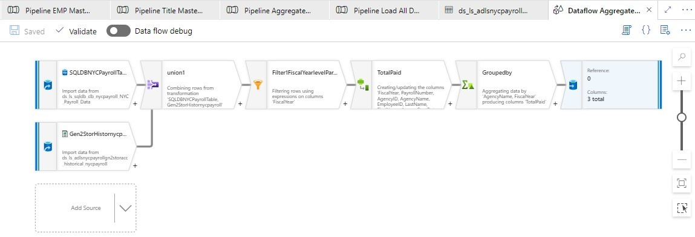

# 2023-AzureFactory-AutomatedPipe
<h1 align="center">
   
  
   
  Development Technologies 
   
</h1>

  
  
  
  
  
  

 
  

  <a href="#Purpose">Purpose</a> •
  <a href="#how-to-use">How It Work</a> •
  <a href="#CodeFlow">Code Flow</a> •
  <a href="#Credit">Credit</a> •
  <a href="#Screen">Screen</a> •

## Purpose
The goal of this project is to develop a Automated Pipeline solution using Azure Data Factory
 .
Bussiness Requirements :
* Analyzing how the City's financial resources are allocated and how much of the City's budget is being devoted to overtime.
* Making the data available to the interested public to show how the City’s budget is being spent on salary and overtime pay for all municipal employees.
* Analytics per year groups
* Analytics per Agency & payments 

> **Note**
> Resources related to each step are divided into their respective folders.

## CodeFlow

Step 0: Create and Configure Azure Resources  
* Create and configure Azure Data Factory and Synapse Analytics services
* Link the Azure Data Factory and Synapse Analytics services together
* Set up Gen 2 Storage account and create the required directories (Historical, Staging, Files)

Step 1: Load CSV Archive File to Gen 2 Storage  
* Load the extracted data to the corresponding directories in Gen 2 Storage (Historical, Staging, Files)

Step 2: Load Current Year Data to SQL DB

* Build and configure the required pipelines in Azure Data Factory to extract the current year data from the CSV archive file at Gen 2 Storage
* Load the current year data into a SQL database using Synapse Analytics

Step 3: Load Current Year Data and Other Data into Respective Synapse Tables  

* Build and configure the required data sets, data flows, and pipelines in Azure Data Factory to extract and transform data from the SQL database and other data from Gen 2 sources
* Load the transformed data into their respective Synapse tables in Azure Synapse Analytics

Step 4: Aggregate Data and Transform it in Data Flow  

* Build a data flow to aggregate data according to the business requirements
* Transform the data in the data flow using appropriate parameters
* Send the transformed data to the respective Synapse table

## How It Work

* To install and set up the project, please follow these steps:

1-Clone the repository from GitHub. 
2-Set up an Azure account and create an Azure Data Factory, Synapse, Gen2 Storage and SQL DB instance. 
3-Create the appropriate directories in the Gen2 Storage (Staging, Historical, and Current). 
4-Load the CSV archive file to Gen2 Storage. 
5-Use Data Factory to move the current year data to SQL DB. 
6-Design an aggregated flow as per business requirements. 
7-Design an aggregated flow as per business requirements. 
8-Automate the flow using the appropriate parameters and transformations. 

The key features and functionality of this project include:

* Automated Pipeline Solution: The project provides an automated pipeline solution using Azure Data Factory to extract, transform and load data from various sources into Azure Synapse Analytics for further analysis.
* Business Requirements: The project addresses the business requirements related to analyzing the City's financial resources, making data available to the public, and performing analytics per year groups and per agency & payments.
* Modularized Resource Organization: The project has organized resources related to each step into their respective folders, making it easier for users to locate and manage the required resources.
* Use of Azure Services: The project utilizes various Azure services such as Azure Data Factory, Synapse Analytics, Gen2 Storage, and SQL DB to efficiently handle the data pipeline solution.

> **Note**
> Please make sure to follow the steps in order and ensure that all the required resources are set up and configured properly before proceeding with each step.
 

## Credit
Matt Swaffer : (https://www.linkedin.com/in/luckypamula/)
 
Udacity : (https://www.udacity.com/course/data-engineering-with-microsoft-azure-nanodegree--nd0277)

This software uses the following open source packages:

See requirements.txt

---

> Website(https://) -
> GitHub (https://github.com/Marshi00) - 
> Linkedin (https:)
